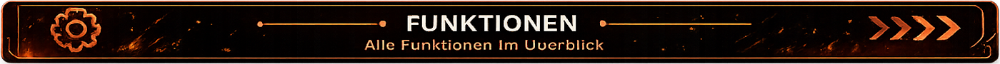
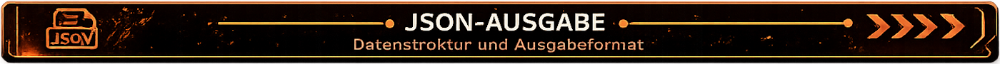
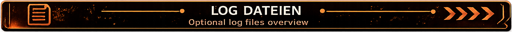
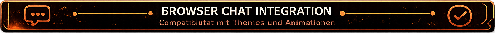

<p align="center">
    
</p>

# Browser Chat v1.1

Ein modulares Browser-Source-Chat-Overlay für **OBS Studio**, entwickelt für **Streamer.bot**.

Browser Chat stellt Twitch-Chatnachrichten, Main Events und Community Events direkt als Browser-Quelle in OBS Studio dar.

Das Projekt basiert auf einer modularen Architektur. Themes, Animationen und zukünftige Erweiterungen können unabhängig vom Browser-Chat-Kern hinzugefügt werden, ohne die Basisdateien verändern zu müssen.

---

<p align="center">
    
</p>

# ✨ Funktionen

## Browser Chat

- Leichtgewichtiges Browser-Source-Overlay
- Für OBS Studio optimiert
- Streamer.bot-Integration
- Twitch-Chat-Unterstützung
- Twitch-Main-Event-Unterstützung
- Twitch-Community-Event-Unterstützung
- Automatische JSON-Verarbeitung
- Unterstützung für Twitch-Emotes
- Unterstützung für Twitch-Badges
- Plattform-Icons
- Automatisches Entfernen alter Nachrichten
- Moderne modulare Architektur

---

<p align="center">
    
</p>

# 📖 Beschreibung

Browser Chat wurde modular aufgebaut.

Das Overlay trennt den Browser-Chat-Kern vollständig von Themes, Animationen und zukünftigen Erweiterungen.

Neue Funktionen können ergänzt werden, ohne bestehende Browser-Chat-Dateien verändern zu müssen.

Dadurch bleibt das Projekt übersichtlich, leicht wartbar und einfach erweiterbar.

---

<p align="center">
    
</p>

# 👥 Unterstützte Community Events

Browser Chat unterstützt folgende Twitch-Community-Events:

- Raid
- Hype Train
- Umfrage (Poll)
- Prediction
- Kanalpunkte (Channel Point Redemption)

---

<p align="center">
    
</p>

# ⚙ Browser Chat Funktionen

Das Browser-Chat-System unterstützt

- Modulare Themes
- Modulare Animationen
- JSON-basierte Kommunikation
- Streamer.bot-Integration
- Main Events
- Community Events
- Plattform-Icons
- Twitch-Emotes
- Twitch-Badges
- Automatische Nachrichtenbereinigung

---

<p align="center">
    
</p>

# 📄 JSON-Ausgabe

Browser Chat liest sämtliche Daten automatisch aus

```text
overlay/data/data.json
```

Diese Datei wird kontinuierlich von den Streamer.bot-Actions aktualisiert und anschließend vom Browser Chat verarbeitet.

---

<p align="center">
    
</p>

# 📝 Log-Dateien

Optional können Log-Dateien für Debugging und Entwicklung erstellt werden.

Aktuelle Log-Module

- Main Event
- Community Raid / Hype Train
- Community Poll
- Community Prediction
- Community Channel Point Redemption

---

<p align="center">
    
</p>

# 🖼 Screenshots

Im Projekt befinden sich Screenshots aller verfügbaren Browser-Chat-Themes sowie unterstützter Community Events.

Dadurch lässt sich das Erscheinungsbild bereits vor der Verwendung im Stream ansehen.

---

<p align="center">
    
</p>

# 🔗 Browser Chat Integration

Browser Chat arbeitet direkt mit Streamer.bot zusammen.

Aktuell werden drei Streamer.bot-Actions verwendet:

- Chat Overlay
- Chat Overlay – Main Event
- Chat Overlay – Community Event

Themes und Animationen werden unabhängig vom Browser-Chat-Kern geladen und können jederzeit erweitert oder ausgetauscht werden.

---

# 📄 Lizenz

Dieses Projekt steht unter der MIT-Lizenz.

Browser Chat darf frei verwendet, angepasst und erweitert werden.

---

<p align="center">

**Browser Chat v1.1**

Mit ❤️ für die Streamer.bot-Community entwickelt.

</p>