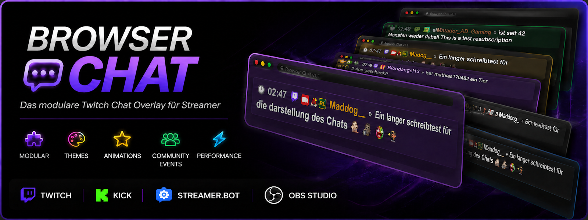
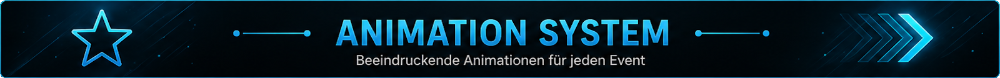

<p align="center">
    
</p>

# Browser Chat v1.1

Ein modulares Browser-Source-Chat-Overlay für **OBS Studio**, entwickelt für **Streamer.bot**.

Browser Chat stellt Twitch-Chatnachrichten, Main Events und Community Events direkt als Browser-Quelle in OBS Studio dar.

Das Projekt basiert auf einer modularen Architektur. Themes, Animationen und zukünftige Erweiterungen können unabhängig vom Browser-Chat-Kern hinzugefügt werden, ohne bestehende Dateien verändern zu müssen.

---

<p align="center">
    
</p>

# ✨ Funktionen

## Browser Chat

- Leichtgewichtiges Browser-Source-Overlay
- Optimiert für OBS Studio
- Streamer.bot-Integration
- Unterstützung für Twitch-Chat
- Unterstützung für Twitch-Main-Events
- Unterstützung für Twitch-Community-Events
- Automatische JSON-Verarbeitung
- Unterstützung für Twitch-Emotes
- Unterstützung für Twitch-Badges
- Plattform-Icons
- Automatische Nachrichtenbereinigung
- Moderne modulare Architektur

---

## Community Events

Unterstützte Community Events

- Follow
- Subscription
- Resubscription
- Gift Subscription
- Cheer
- Raid
- Hype Train
- Umfrage (Poll)
- Prediction
- Kanalpunkte (Channel Point Redemption)

---

## Theme-System

Browser Chat unterstützt modulare CSS-Themes.

### Enthaltene Themes

- Standard
- Streamer Accent Theme
- Dark
- Yellow
- Green
- Purple
- Self Create Theme

### Theme-Funktionen

- Streamer Accent Color
- Reward Accent Color
- Unterstützung für Main Events
- Unterstützung für Community Events
- Unabhängige CSS-Dateien
- Einfache Anpassung

Jedes Theme kann unabhängig aktiviert, ersetzt oder erweitert werden.

---

## Animations-System

Browser Chat unterstützt modulare CSS-Animationen.

### Enthaltene Animationen

- Fade
- Pop
- Slide Left
- Slide Right
- Zoom
- Self Create Animation

### Animations-Funktionen

- Leichtgewichtige CSS-Animationen
- Unabhängige Animationsdateien
- Einfache Anpassung
- Modulare Architektur

Animationen überschreiben ausschließlich die Einblendanimation.

Die Ausblendanimation bleibt Bestandteil des Browser-Chat-Kerns.

---

## Streamer.bot

Browser Chat verwendet aktuell drei Streamer.bot-Actions.

- Chat Overlay
- Chat Overlay – Main Event
- Chat Overlay – Community Event

---

## Logging

Optionale Log-Dateien stehen für Debugging und Entwicklung zur Verfügung.

Aktuelle Log-Module

- Main Event
- Community Raid / Hype Train
- Community Poll
- Community Prediction
- Community Channel Point Redemption

---

<p align="center">
    
</p>

# 🎨 Theme-System

Browser Chat trennt das Erscheinungsbild vollständig vom Browser-Chat-Kern.

Themes überschreiben ausschließlich das Design, während Browser Chat selbst unverändert bleibt.

Jedes Theme unterstützt

- Streamer Accent Color
- Reward Accent Color
- Main Events
- Community Events

Neue Themes können jederzeit durch das Hinzufügen einer weiteren CSS-Datei erstellt werden.

---

<p align="center">
    
</p>

# ✨ Animations-System

Animationen sind vollständig vom Browser-Chat-Kern getrennt.

Jede Animation befindet sich in einer eigenen CSS-Datei und kann jederzeit ausgetauscht werden.

Enthaltene Animationen

- Fade
- Pop
- Slide Left
- Slide Right
- Zoom
- Self Create Animation

Die Standard-Fade-Animation ist Bestandteil von Browser Chat.

Zusätzliche Animationsdateien überschreiben ausschließlich die Einblendanimation.

---

<p align="center">
    
</p>

# 🚀 Community Events

Community Events erweitern Browser Chat um Twitch-Ereignisse.

Jedes Event erzeugt automatisch eine standardisierte JSON-Struktur, die direkt vom Browser Chat verarbeitet werden kann.

Jedes Community Event unterstützt

- JSON-Ausgabe
- Optionale Log-Dateien
- Eigenes Event-Icon
- Individuelle Event-Darstellung
- Theme-Unterstützung
- Animations-Unterstützung

Für eine ausführliche Beschreibung aller Community Events siehe:

**README_COM_EVENT.de.md**

---

<p align="center">
    
</p>

# 📁 Ordnerstruktur

```text
OBS-Overlay-Chat/
│
├── overlay/
│   ├── asset/
│   ├── data/
│   ├── logs/
│   ├── styles/
│   │   ├── animation/
│   │   └── themes/
│   ├── chat.js
│   ├── style.css
│   └── index.html
│
├── Streamer.bot/
├── screenshots/
│
├── README.md
├── README.de.md
├── README_COM_EVENT.md
├── README_COM_EVENT.de.md
├── CHANGELOG.md
└── LICENSE
```

Browser Chat wurde als modulares Projekt entwickelt.

Der Browser-Chat-Kern bleibt unverändert, während Themes und Animationen unabhängig geladen werden.

---

<p align="center">
    
</p>

# ⚙ Installation

1. Browser Chat in einen beliebigen Ordner kopieren.
2. Den Ordner als Browser-Quelle in OBS Studio hinzufügen.
3. Die Streamer.bot-Actions importieren.
4. Falls erforderlich den JSON-Pfad anpassen.
5. Ein Theme auswählen.
6. Eine Animation auswählen.
7. Stream starten.

---

<p align="center">
    
</p>

# 📄 Lizenz

Dieses Projekt steht unter der MIT-Lizenz.

Browser Chat darf frei verwendet, angepasst und erweitert werden.

---

<p align="center">

**Browser Chat v1.1**

Mit ❤️ für die Streamer.bot-Community entwickelt.

</p>