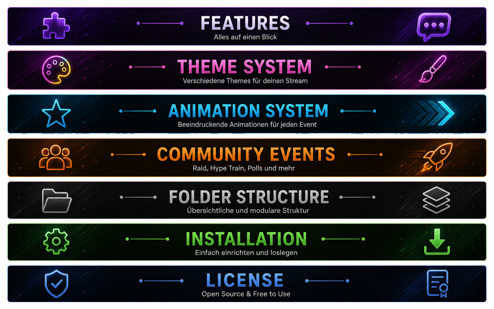

<p align="center">
    
</p>

# Browser Chat v1.1

A modular Browser Source chat overlay for **OBS Studio**, powered by **Streamer.bot**.

Browser Chat displays Twitch Chat Messages, Main Events and Community Events directly inside OBS Studio as a lightweight Browser Source.

The project is built around a modular architecture. Themes, animations and future extensions can be added independently without modifying the Browser Chat core.

---

<p align="center">
    
</p>

# ✨ Features

## Browser Chat

- Lightweight Browser Source
- Optimized for OBS Studio
- Streamer.bot integration
- Twitch Chat support
- Twitch Main Event support
- Twitch Community Event support
- Automatic JSON processing
- Twitch Emote support
- Twitch Badge support
- Platform icons
- Automatic message cleanup
- Modern modular architecture

---

## Community Events

Supported Community Events

- Follow
- Subscription
- Resubscription
- Gift Subscription
- Cheer
- Raid
- Hype Train
- Poll
- Prediction
- Channel Point Redemption

---

## Theme System

Browser Chat supports modular CSS themes.

### Included Themes

- Default
- Streamer Accent Theme
- Dark
- Yellow
- Green
- Purple
- Self Create Theme

### Theme Features

- Streamer Accent Color
- Reward Accent Color
- Main Event support
- Community Event support
- Independent CSS files
- Easy customization

Every theme can be enabled, replaced or extended independently.

---

## Animation System

Browser Chat supports modular CSS animations.

### Included Animations

- Fade
- Pop
- Slide Left
- Slide Right
- Zoom
- Self Create Animation

### Animation Features

- Lightweight CSS animations
- Independent animation files
- Easy customization
- Modular architecture

Animations override only the message entrance.

Fade-out remains part of the Browser Chat core.

---

## Streamer.bot

Browser Chat currently uses three Streamer.bot Actions.

- Chat Overlay
- Chat Overlay – Main Event
- Chat Overlay – Community Event

---

## Logging

Optional log files are available for debugging and development.

Current log modules

- Main Event
- Community Raid / Hype Train
- Community Poll
- Community Prediction
- Community Channel Point Redemption

---

<p align="center">
    
</p>

# 🎨 Theme System

Browser Chat completely separates its appearance from the Browser Chat core.

Themes only override the visual design while Browser Chat itself remains unchanged.

Every theme supports

- Streamer Accent Color
- Reward Accent Color
- Main Events
- Community Events

New themes can be created simply by adding another CSS file.

---

<p align="center">
    
</p>

# ✨ Animation System

Animations are fully separated from the Browser Chat core.

Each animation is stored inside its own CSS file and can be replaced at any time.

Included Animations

- Fade
- Pop
- Slide Left
- Slide Right
- Zoom
- Self Create Animation

The default Fade animation is part of Browser Chat.

Additional animation files override only the message entrance animation.

---

<p align="center">
    
</p>

# 🚀 Community Events

Community Events extend Browser Chat with Twitch event notifications.

Every event automatically creates a standardized JSON structure that is fully compatible with Browser Chat.

Every Community Event supports

- JSON output
- Optional log files
- Individual event icons
- Individual event styling
- Theme support
- Animation support

For a complete overview of all Community Events, see:

**README_COM_EVENT.md**

---

<p align="center">
    
</p>

# 📁 Folder Structure

```text
OBS-Overlay-Chat/
│
├── overlay/
│   ├── asset/
│   ├── data/
│   ├── logs/
│   ├── styles/
│   │   ├── animation/
│   │   └── themes/
│   ├── chat.js
│   ├── style.css
│   └── index.html
│
├── Streamer.bot/
├── screenshots/
│
├── README.md
├── README.de.md
├── README_COM_EVENT.md
├── README_COM_EVENT.de.md
├── CHANGELOG.md
└── LICENSE
```

Browser Chat is designed as a modular project.

The Browser Chat core remains unchanged while Themes and Animations are loaded independently.

---

<p align="center">
    
</p>

# ⚙ Installation

1. Copy the Browser Chat folder.
2. Add the folder as a Browser Source in OBS Studio.
3. Import the Streamer.bot Actions.
4. Adjust the JSON path if required.
5. Select your preferred Theme.
6. Select your preferred Animation.
7. Start streaming.

---

<p align="center">
    
</p>

# 📄 License

This project is released under the MIT License.

Feel free to use, modify and extend Browser Chat for your own projects.

---

<p align="center">

**Browser Chat v1.1**

Made with ❤️ for the Streamer.bot Community.

</p>