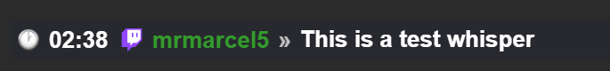
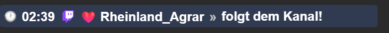
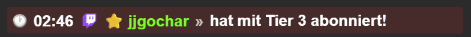
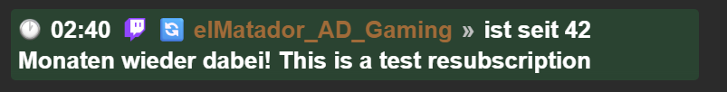
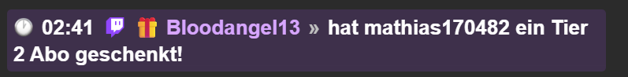
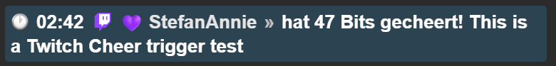

## Browser Chat v1.0

A modern BrowserSource chat overlay for **Streamer.bot** and **OBS Studio**.

Browser Chat displays live Twitch chat messages and Twitch events in real time using a clean, modern and fully customizable browser overlay.

Designed for streamers who want a lightweight, easy-to-understand and fully local solution.

---

# Features

- 💬 Live Twitch Chat
- 💚 Follow Events
- ⭐ Subscription Events
- 🔄 Resubscription Events
- 🎁 Gift Subscription Events
- 💜 Cheer (Bits) Events
- 🎨 Individual event colors
- 🖼 Platform badges
- ⏰ Optional timestamp badge
- 📄 Integrated event logger
- ⚡ Single Streamer.bot Main Event Action
- 🛠 HTML / CSS / JavaScript based BrowserSource
- 📦 Easy to customize

---

# Folder Structure

```text
OBS-Overlay-Chat/
│
├── overlay/
├── Streamer.bot/
├── screenshots/
├── README.md
├── CHANGELOG.md
└── LICENSE
```

---

# Requirements

- OBS Studio
- Streamer.bot
- Twitch Account

---

# Installation

## 1. Copy the Overlay

Copy the **overlay** folder to any location on your computer.

Example:

```
D:\OBS-Overlay-Chat\overlay\
```

---

## 2. Import Streamer.bot Actions

Import the following actions into Streamer.bot:

- Chat Overlay
- Chat Overlay - Main Event

---

## 3. Configure the Paths

Open the C# Sub-Action inside **Chat Overlay - Main Event** and adjust the following paths:

```csharp
string dataPath =
@"YOUR_PATH\overlay\data\data.json";

string logPath =
@"YOUR_PATH\overlay\Log\chatOverlay_Event.log";
```

---

## 4. Add Browser Source

Create a new Browser Source inside OBS.

Point it to:

```
overlay/index.html
```

Set the desired width and height.

---

# Screenshots

## Chat Overlay



---

## Follow Event



---

## Subscription Event



---

## Resubscription Event



---

## Gift Subscription Event



---

## Cheer Event



---

# Privacy

Browser Chat processes all data locally.

- No telemetry
- No tracking
- No external servers
- No cloud services
- No user data collection

All generated files remain on your local computer.

---

# License

This project is released under the MIT License.

See the LICENSE file for details.

---

# Credits

Created by **MaddogBerlin**

Browser Chat was developed as a free community project for Streamer.bot and OBS Studio.

If you enjoy using it, feel free to improve it, fork it or contribute to future versions.

Happy Streaming! ❤️