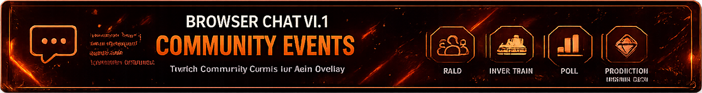

<p align="center">
    
</p>

# Browser Chat v1.1
# Community Events

The Community Event module extends Browser Chat with Twitch Community Events.

Besides regular Twitch chat messages, Browser Chat can display important Community Events directly inside the overlay.

Every supported event automatically generates

- JSON output
- Optional log file
- Browser Chat overlay message
- Individual event styling

---

<p align="center">
    
</p>

## Description

Browser Chat Community Events were designed to integrate seamlessly into the Browser Chat Overlay.

Each supported Twitch Community Event writes a standardized JSON structure, allowing Browser Chat to display every event using the same rendering system.

The modular architecture keeps every event independent while maintaining a consistent output format.

---

<p align="center">
    
</p>

## Supported Community Events

Currently supported

- 🚀 Raid
- 🚂 Hype Train
- 📊 Poll
- 🎯 Prediction
- ✅ Channel Point Redemption

Every module follows the same Browser Chat JSON structure.

---

<p align="center">
    
</p>

## Features

Community Events provide

- Individual C# module for every event
- Shared Browser Chat JSON format
- Optional log files
- Event icons
- Individual event styling
- Browser Chat Theme support
- Browser Chat Animation support
- Lightweight modular architecture

---

<p align="center">
    
</p>

## JSON Output

Every Community Event writes its data into

```text
overlay/data/data.json
```

Browser Chat automatically reads this file and displays the event inside the overlay.

Every JSON structure follows the same format to ensure compatibility with Browser Chat.

---

<p align="center">
    
</p>

## Log Files

Optional log files are available for debugging and development.

Current Community Event modules

```text
chatOverlay_CommunityRaidHypeEvent.txt
chatOverlay_CommunityPollEvent.txt
chatOverlay_CommunityPredictionEvent.txt
chatOverlay_CommunityChannelPointEvent.txt
```

The log files simplify troubleshooting and development of new Community Events.

---

<p align="center">
    
</p>

## Screenshots

The repository contains screenshots for every supported Community Event.

These screenshots demonstrate

- Event appearance
- Theme compatibility
- Browser Chat integration
- Overlay rendering

---

<p align="center">
    
</p>

## Browser Chat Integration

Community Events are fully integrated into Browser Chat.

They automatically support

- Browser Chat Themes
- Browser Chat Animations
- Streamer Accent Theme
- Future Browser Chat updates

No additional Browser Chat modifications are required.

---

## Version

**Browser Chat v1.1**

Made with ❤️ for the Streamer.bot Community.