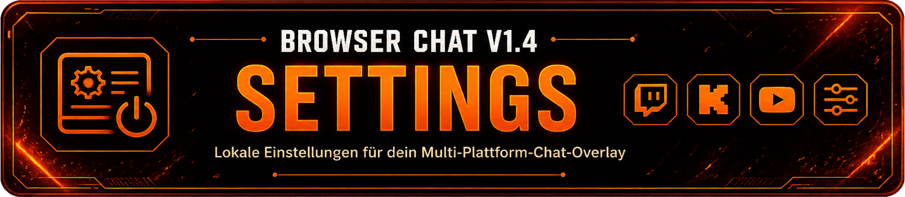
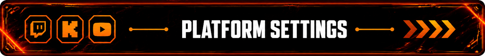
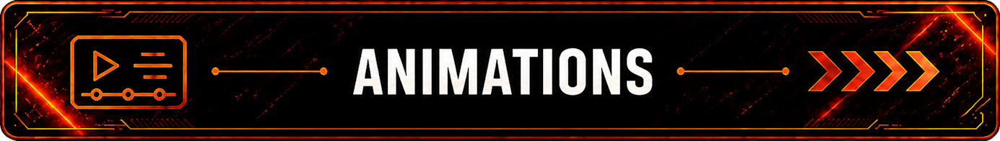
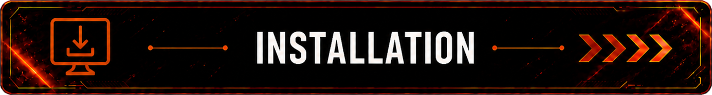

<p align="center">
    
</p>

# Browser Chat Settings v1.4

> Browser Chat Settings is the local configuration interface for **Browser Chat v1.4**.

> The Settings interface allows Twitch, Kick and YouTube, chat themes, colors, fonts, animations, Live Chat display duration and tablet design to be configured directly and reviewed in a live preview.

> Settings are validated through **Streamer.bot** and permanently stored in `data/settings.json`.

> The Settings interface operates separately from the protected Browser Chat core, allowing configuration without directly editing the base files `chat.js` and `style.css`.

---

<p align="center">
    
</p>

# ✨ Features

Browser Chat Settings provides a central interface for configuring and previewing Browser Chat v1.4.

## Platform Settings

- Separate settings for Twitch, Kick and YouTube
- Selection of chat theme, background color, text color and font
- Shared chat width setting
- Direct preview of changes
- Platform-specific themes without affecting the other platforms

## Twitch Emotes & Filters

- BetterTTV Global and Channel Emotes
- 7TV Global and Channel Emotes
- FrankerFaceZ Global and Room Emotes
- Hide chat commands from the overlay
- Custom command prefix
- Hide individual commands
- Bot responses to hidden commands remain visible

## Animations

- Fade
- Pop
- Slide Left
- Slide Right
- Zoom
- Self Create Animation
- Dedicated animation preview
- Adjustable preview speed
- Adjustable display duration
- Automatic preview restart

## Live Chat Settings

- Preview of the actual Browser Chat
- Adjustable message display duration from 10 to 45 seconds
- Default display duration of 18 seconds
- Dedicated Browser Source information section
- Live Chat and animation preview operate independently

## Tablet Settings

- Button color and tablet border color can be configured separately
- Separate Colors
- Link Colors
- Djain Trail
- Harmony
- Independent storage of the tablet appearance
- Separate save status

## Language

- German
- English
- Spanish
- French
- Portuguese (Brazil)
- Hindi
- English as fallback language
- Storage of the selected language

## Storage

- Direct transfer of settings to Streamer.bot
- Validation of transferred values through C#
- Permanent storage in `data/settings.json`
- Separate storage of platform settings
- Protection against accidentally discarding unsaved changes

---

<p align="center">
    
</p>

# 🎨 Platform Settings

Twitch, Kick and YouTube each have their own configuration section in Browser Chat Settings.

The appearance and chat theme for each platform can be configured independently.

## Available Settings

- Chat theme
- Background color
- Text color
- Font

The shared window width is located in the **Local** section and applies to Twitch, Kick and YouTube.

The width can be adjusted between **320 and 960 px**. The Live Chat preview keeps its own fixed preview zoom.

When a predefined theme is selected for a platform, the custom background color is disabled and visibly grayed out in the Settings interface.

Text color and font remain configurable independently of the selected theme.

Changes made to one platform only affect the corresponding Twitch, Kick or YouTube appearance in the Live Chat preview.

---

## Twitch Emotes & Filters

Twitch provides additional settings for external emote services and the display of chat commands in the overlay.

### Supported Emote Services

- BetterTTV Global and Channel Emotes
- 7TV Global and Channel Emotes
- FrankerFaceZ Global and Room Emotes

The emote services can be enabled or disabled individually.

Native Twitch emotes and Twitch badges remain fully available independently of these settings.

### Chat Command Filter

Chat commands can be hidden from Browser Chat without disabling their functionality in Streamer.bot.

- Hide chat commands from the overlay
- Set a custom command prefix
- Hide individual commands
- Dynamic overview of hidden commands
- Bot responses remain visible in the overlay

The filter is applied before the output is written to `data.json`. This prevents a hidden chat command from being passed to the Browser overlay, while Streamer.bot can still process the command normally.

---

<p align="center">
    
</p>

# ✨ Animation Settings & Preview

Browser Chat Settings includes a dedicated preview for the available chat animations.

The animation preview operates independently from the actual Live Chat and allows animations to be tested without modifying the existing Browser Chat files.

## Available Animations

- Fade
- Pop
- Slide Left
- Slide Right
- Zoom
- Self Create Animation

## Animation Preview

The preview automatically displays sample messages from Twitch, Kick and YouTube.

- A maximum of four messages visible at the same time
- Automatic sequence of sample messages
- Automatic restart after the preview ends
- Adjustable preview speed
- Adjustable display duration
- Separate preview for Self Create Animation

Changes made within the animation preview are used for testing purposes only and do not modify the actual Browser Chat animation files.

---

<p align="center">
    
</p>

# 💬 Live Chat Settings

Browser Chat Settings includes its own live preview of the actual Browser Chat.

Unlike the animation preview, this section uses the actual Browser Chat appearance and allows the selected settings to be checked directly.

## Message Display Duration

The amount of time a chat message remains visible in Browser Chat can be configured directly through the Settings interface.

- Adjustable range from 10 to 45 seconds
- Default value: 18 seconds
- Directly applied to the Live Chat preview
- Permanently stored in `settings.json`

The configured display duration applies to the actual Browser Chat and operates independently from the display duration of the animation preview.

## Browser Source Information

This section also contains information for using Browser Chat as a local Browser Source in OBS Studio.

The Live Chat preview is intended only for checking the appearance and does not replace the actual Browser Source in OBS Studio.

---

<p align="center">
    
</p>

# 📱 Tablet Settings

Browser Chat Settings includes its own design system for the appearance of the Settings tablet.

The tablet design operates independently from the chat themes for Twitch, Kick and YouTube.

## Colors

The button color and tablet border color can be configured individually.

Two basic color modes are available:

- Separate Colors
- Link Colors

With **Separate Colors**, the button color and tablet border color can be selected independently.

With **Link Colors**, both colors are linked and used together.

## Tablet Designs

Two additional tablet designs are available:

### Djain Trail

- Violet-blue glow
- Animated border
- Synchronized power button pulse

### Harmony

- Split red-silver border
- Two-color power button pulse
- Dedicated harmonious color appearance

The tablet settings have their own save status and are managed independently from changes to the platform settings.

---

<p align="center">
    
</p>

# 🌐 Language

Browser Chat Settings includes its own language system for the entire Settings interface.

## Supported Languages

- German
- English
- Spanish
- French
- Portuguese (Brazil)
- Hindi

The preferred language can be selected directly through the Settings interface.

The selection is saved and automatically restored the next time the Settings interface is opened.

## Fallback Language

English is used as the fallback language.

If a translation entry is missing from the currently selected language, the corresponding English entry can be used instead.

The language system is modular. Additional languages can be added later by providing additional language files.

---

<p align="center">
    
</p>

# 💾 Storage

Browser Chat Settings are permanently stored through Streamer.bot.

For this purpose, Browser Chat uses the dedicated Streamer.bot Action **Chat Overlay - Save Settings**.

## Storage through Streamer.bot

When saving, the current settings are transferred to Streamer.bot.

The Save Settings Action then handles:

- Validation of the transferred values
- Processing of the Settings data
- Storage of the configuration
- Updating `settings.json`
- Optional writing of the Settings log

The saved configuration is located at:

`overlay/data/settings.json`

`data.json` remains separate and continues to be used exclusively for current chat and event data.

## Save Status

The Settings interface displays the current save status directly.

Changes to the settings are detected so that unsaved changes are not accidentally discarded.

The tablet settings additionally have their own save status and can be saved independently from the other settings.

---

<p align="center">
    
</p>

# ⚙ Installation & Setup

Browser Chat Settings are part of Browser Chat v1.4 and are located entirely inside the local `overlay` folder.

## Opening the Settings

The Settings interface is launched through:

`overlay/settings.html`

This file acts as a starter and opens the actual Settings interface located at:

`overlay/settings/settingsBase.html`

## Preparing Streamer.bot

To permanently store the settings, the Streamer.bot Action

**Chat Overlay - Save Settings**

is required.

After importing the Action, the local file paths must be adjusted once to match your own Browser Chat folder.

To do this, open the following Action in **Streamer.bot**:

**Chat Overlay - Save Settings**

and then open the **C# Sub-Action** contained within it.

The C# code contains the following two paths:

- `settingsPath` → location of `settings.json`
- `settingsLogPath` → location of the optional Settings log file

Both paths must be adjusted to match your own local Browser Chat folder.

### Example

```csharp
string settingsPath = @"YOUR PATH\overlay\data\settings.json";
string settingsLogPath = @"YOUR PATH\overlay\Log\chatOverlay_saveSettingsLog.txt";
```

Only the local path to your own Browser Chat folder needs to be changed. The intended file names and folder structure should be kept unchanged.

The saved settings are then located at:

`overlay/data/settings.json`

The optional Settings log is written to:

`overlay/Log/chatOverlay_saveSettingsLog.txt`

## Initial Setup

1. Open `overlay/settings.html` in your browser.
2. Configure Twitch, Kick and YouTube as desired.
3. Configure the theme, colors, font and chat width.
4. Select the desired animation and test it using the preview.
5. Set the Live Chat message display duration.
6. Select the tablet design and language.
7. Configure optional Twitch emote services and the chat command filter.
8. Save the settings.

After saving, the configuration remains permanently available to Browser Chat.

---

# 📖 Further Information

For more information about Browser Chat, Community Events, themes and animations, see the main documentation:

**README.md**

The German documentation for Browser Chat Settings is available here:

**README_SETTING.de.md**

---

<p align="center">

**Browser Chat Settings v1.4**

Made with ❤️ for the Streamer.bot Community.

</p>