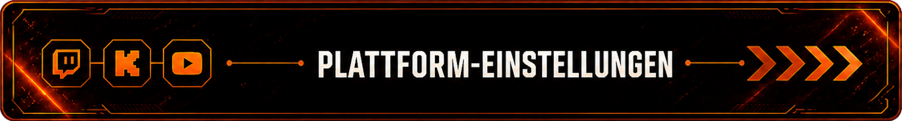

<p align="center">
    
</p>

# Browser Chat Settings v1.4

> Die Browser Chat Settings sind die lokale Konfigurationsoberfläche für **Browser Chat v1.4**.

> Über die Settings können Twitch, Kick und YouTube, Chat-Themes, Farben, Schriftarten, Animationen, Live-Chat-Anzeigedauer und das Tablet-Design direkt konfiguriert und in einer Live-Vorschau überprüft werden.

> Die Einstellungen werden über **Streamer.bot** geprüft und dauerhaft in `data/settings.json` gespeichert.

> Die Settings-Oberfläche arbeitet getrennt vom geschützten Browser-Chat-Kern und ermöglicht die Konfiguration, ohne die Basisdateien `chat.js` und `style.css` direkt bearbeiten zu müssen.

---

<p align="center">
    
</p>

# ✨ Funktionen

Die Browser Chat Settings bieten eine zentrale Oberfläche zur Konfiguration und Vorschau von Browser Chat v1.4.

## Plattform-Einstellungen

- Separate Einstellungen für Twitch, Kick und YouTube
- Auswahl von Chat-Theme, Hintergrundfarbe, Textfarbe und Schriftart
- Gemeinsame Einstellung der Chatbreite
- Direkte Darstellung der Änderungen in der Vorschau
- Plattformabhängige Themes ohne Beeinflussung der anderen Plattformen

## Twitch Emotes & Filter

- BetterTTV Global- und Kanal-Emotes
- 7TV Global- und Kanal-Emotes
- FrankerFaceZ Global- und Raum-Emotes
- Chatbefehle im Overlay ausblenden
- Eigenes Befehlspräfix
- Einzelne Befehle gezielt ausblenden
- Bot-Antworten auf ausgeblendete Befehle bleiben sichtbar

## Animationen

- Fade
- Pop
- Slide Left
- Slide Right
- Zoom
- Self Create Animation
- Eigene Animationsvorschau
- Einstellbare Vorschaugeschwindigkeit
- Einstellbare Darstellungsdauer
- Automatische Wiederholung der Vorschau

## Live Chat Settings

- Vorschau des echten Browser Chats
- Einstellbare Nachrichten-Anzeigedauer von 10 bis 45 Sekunden
- Standard-Anzeigedauer von 18 Sekunden
- Eigener Bereich für Browser-Source-Informationen
- Live Chat und Animationsvorschau arbeiten unabhängig voneinander

## Tablet-Einstellungen

- Knopffarbe und Tablet-Randfarbe separat einstellbar
- Farben getrennt
- Farben verbinden
- Djain-Schweif
- Harmony
- Eigene Speicherung der Tablet-Darstellung
- Separater Speicherstatus

## Sprache

- Deutsch
- Englisch
- Spanisch
- Französisch
- Portugiesisch (Brasilien)
- Hindi
- Englisch als Fallback-Sprache
- Speicherung der gewählten Sprache

## Speicherung

- Direkte Übergabe der Einstellungen an Streamer.bot
- Prüfung der übertragenen Werte durch C#
- Dauerhafte Speicherung in `data/settings.json`
- Getrennte Speicherung der Plattform-Einstellungen
- Schutz vor unbeabsichtigtem Verwerfen ungespeicherter Änderungen

---

<p align="center">
    
</p>

# 🎨 Plattform-Einstellungen

Twitch, Kick und YouTube besitzen in den Browser Chat Settings jeweils einen eigenen Einstellungsbereich.

Für jede Plattform können die Darstellung und das verwendete Chat-Theme unabhängig voneinander konfiguriert werden.

## Verfügbare Einstellungen

- Chat-Theme
- Hintergrundfarbe
- Textfarbe
- Schriftart

Die gemeinsame Fensterbreite befindet sich im Bereich **Local** und gilt für Twitch, Kick und YouTube.

Die Breite kann zwischen **320 und 960 px** eingestellt werden. Die Live-Chat-Vorschau behält dabei ihren eigenen festen Vorschau-Zoom bei.

Wird für eine Plattform ein festes Theme ausgewählt, wird die eigene Hintergrundfarbe deaktiviert und in den Settings sichtbar ausgegraut.

Textfarbe und Schriftart bleiben unabhängig vom ausgewählten Theme einstellbar.

Änderungen an einer Plattform wirken in der Live-Vorschau ausschließlich auf die entsprechende Twitch-, Kick- oder YouTube-Darstellung.

---

## Twitch Emotes & Filter

Twitch besitzt zusätzliche Einstellungen für externe Emote-Dienste und die Darstellung von Chatbefehlen im Overlay.

### Unterstützte Emote-Dienste

- BetterTTV Global- und Kanal-Emotes
- 7TV Global- und Kanal-Emotes
- FrankerFaceZ Global- und Raum-Emotes

Die Emote-Dienste können einzeln aktiviert oder deaktiviert werden.

Native Twitch-Emotes und Twitch-Badges bleiben unabhängig davon vollständig erhalten.

### Chatbefehlsfilter

Chatbefehle können aus dem Browser Chat ausgeblendet werden, ohne ihre Funktion in Streamer.bot zu deaktivieren.

- Chatbefehle im Overlay ausblenden
- Eigenes Befehlspräfix festlegen
- Einzelne Befehle gezielt ausblenden
- Dynamische Übersicht der ausgeblendeten Befehle
- Bot-Antworten bleiben weiterhin im Overlay sichtbar

Der Filter wird vor der Ausgabe in `data.json` angewendet. Dadurch wird ein ausgeblendeter Chatbefehl nicht an das Browser-Overlay weitergegeben, während Streamer.bot den Befehl weiterhin normal verarbeiten kann.

---

<p align="center">
    
</p>

# ✨ Animations-Einstellungen & Vorschau

Die Browser Chat Settings besitzen eine eigene Vorschau für die verfügbaren Chat-Animationen.

Die Animationsvorschau arbeitet unabhängig vom echten Live Chat und ermöglicht das Testen der Animationen, ohne die bestehenden Browser-Chat-Dateien zu verändern.

## Verfügbare Animationen

- Fade
- Pop
- Slide Left
- Slide Right
- Zoom
- Self Create Animation

## Animationsvorschau

Die Vorschau zeigt automatisch Beispielnachrichten von Twitch, Kick und YouTube.

- Maximal vier Nachrichten gleichzeitig sichtbar
- Automatischer Ablauf der Beispielnachrichten
- Automatischer Neustart nach Ende der Vorschau
- Einstellbare Vorschaugeschwindigkeit
- Einstellbare Darstellungsdauer
- Separate Vorschau für Self Create Animation

Änderungen innerhalb der Animationsvorschau dienen ausschließlich zum Testen und verändern die eigentlichen Animationsdateien des Browser Chats nicht.

---

<p align="center">
    
</p>

# 💬 Live Chat Settings

Die Browser Chat Settings besitzen eine eigene Live-Vorschau des echten Browser Chats.

Im Gegensatz zur Animationsvorschau verwendet dieser Bereich die tatsächliche Darstellung des Browser Chats und ermöglicht eine direkte Kontrolle der gewählten Einstellungen.

## Nachrichten-Anzeigedauer

Die Dauer, für die eine Chatnachricht im Browser Chat sichtbar bleibt, kann direkt über die Settings eingestellt werden.

- Einstellbarer Bereich von 10 bis 45 Sekunden
- Standardwert: 18 Sekunden
- Direkte Übernahme in die Live-Chat-Vorschau
- Dauerhafte Speicherung in `settings.json`

Die eingestellte Anzeigedauer gilt für den echten Browser Chat und arbeitet unabhängig von der Darstellungsdauer der Animationsvorschau.

## Browser-Source-Informationen

Der Bereich enthält zusätzlich Informationen für die Verwendung des Browser Chats als lokale Browser-Quelle in OBS Studio.

Die Live-Chat-Vorschau dient dabei ausschließlich zur Kontrolle der Darstellung und ersetzt nicht die eigentliche Browser-Quelle in OBS Studio.

---

<p align="center">
    
</p>

# 📱 Tablet-Einstellungen

Die Browser Chat Settings besitzen ein eigenes Design-System für die Darstellung des Settings-Tablets.

Das Tablet-Design arbeitet unabhängig von den Chat-Themes für Twitch, Kick und YouTube.

## Farben

Knopffarbe und Tablet-Randfarbe können individuell eingestellt werden.

Dabei stehen zwei grundlegende Farbmodi zur Verfügung:

- Farben getrennt
- Farben verbinden

Bei **Farben getrennt** können Knopffarbe und Tablet-Randfarbe unabhängig voneinander gewählt werden.

Bei **Farben verbinden** werden beide Farben miteinander gekoppelt und gemeinsam verwendet.

## Tablet-Designs

Zusätzlich stehen zwei eigene Tablet-Designs zur Verfügung:

### Djain-Schweif

- Violett-blauer Glow
- Animierter Rand
- Synchronisierter Powerknopf-Puls

### Harmony

- Geteilter Rot-Silber-Rand
- Zweifarbiger Powerknopf-Puls
- Eigene harmonische Farbdarstellung

Die Tablet-Einstellungen besitzen einen eigenen Speicherstatus und werden unabhängig von Änderungen an den Plattform-Einstellungen verwaltet.

---

<p align="center">
    
</p>

# 🌐 Sprache

Die Browser Chat Settings besitzen ein eigenes Sprachsystem für die gesamte Settings-Oberfläche.

## Unterstützte Sprachen

- Deutsch
- Englisch
- Spanisch
- Französisch
- Portugiesisch (Brasilien)
- Hindi

Die gewünschte Sprache kann direkt über die Settings-Oberfläche ausgewählt werden.

Die Auswahl wird gespeichert und beim nächsten Öffnen der Settings automatisch wieder verwendet.

## Fallback-Sprache

Englisch dient als Fallback-Sprache.

Fehlt ein Übersetzungseintrag in der aktuell ausgewählten Sprache, kann dadurch auf den entsprechenden englischen Eintrag zurückgegriffen werden.

Das Sprachsystem ist modular aufgebaut. Weitere Sprachen können später durch zusätzliche Sprachdateien ergänzt werden.

---

<p align="center">
    
</p>

# 💾 Speicherung

Die Browser Chat Settings werden dauerhaft über Streamer.bot gespeichert.

Dafür verwendet Browser Chat die eigene Streamer.bot-Action **Chat Overlay - Save Settings**.

## Speicherung über Streamer.bot

Beim Speichern werden die aktuellen Einstellungen an Streamer.bot übertragen.

Die Save-Settings-Action übernimmt anschließend:

- Prüfung der übertragenen Werte
- Verarbeitung der Settings-Daten
- Speicherung der Konfiguration
- Aktualisierung der `settings.json`
- Optionales Schreiben des Settings-Logs

Die gespeicherte Konfiguration befindet sich unter:

`overlay/data/settings.json`

`data.json` bleibt davon getrennt und wird weiterhin ausschließlich für aktuelle Chat- und Eventdaten verwendet.

## Speicherstatus

Die Settings-Oberfläche zeigt den aktuellen Speicherstatus direkt an.

Änderungen an den Einstellungen werden erkannt, sodass nicht gespeicherte Änderungen nicht unbemerkt verworfen werden.

Die Tablet-Einstellungen besitzen zusätzlich einen eigenen Speicherstatus und können unabhängig von den übrigen Einstellungen gespeichert werden.

---

<p align="center">
    
</p>

# ⚙ Installation & Einrichtung

Die Browser Chat Settings sind Bestandteil von Browser Chat v1.4 und befinden sich vollständig im lokalen `overlay`-Ordner.

## Settings öffnen

Die Settings werden über folgende Datei gestartet:

`overlay/settings.html`

Diese Datei dient als Starter und öffnet die eigentliche Settings-Oberfläche unter:

`overlay/settings/settingsBase.html`

## Streamer.bot vorbereiten

Für das dauerhafte Speichern der Einstellungen wird die Streamer.bot-Action

**Chat Overlay - Save Settings**

benötigt.

Nach dem Import der Action müssen die lokalen Dateipfade einmalig an den eigenen Browser-Chat-Ordner angepasst werden.

Öffne dazu in **Streamer.bot** die Action:

**Chat Overlay - Save Settings**

und anschließend die darin enthaltene **C# Sub-Action**.

Im C#-Code befinden sich die beiden Pfade:

- `settingsPath` → Speicherort der `settings.json`
- `settingsLogPath` → Speicherort der optionalen Settings-Logdatei

Beide Pfade müssen auf den eigenen lokalen Browser-Chat-Ordner angepasst werden.

### Beispiel

```csharp
string settingsPath = @"DEIN PFAD\overlay\data\settings.json";
string settingsLogPath = @"DEIN PFAD\overlay\Log\chatOverlay_saveSettingsLog.txt";
```

Dabei wird nur der lokale Pfad zum eigenen Browser-Chat-Ordner geändert. Die vorgesehenen Dateinamen und Ordnerstrukturen sollten beibehalten werden.

Die gespeicherten Einstellungen befinden sich anschließend unter:

`overlay/data/settings.json`

Das optionale Settings-Log wird unter:

`overlay/Log/chatOverlay_saveSettingsLog.txt`

geführt.

---

## Erste Einrichtung

1. `overlay/settings.html` im Browser öffnen.
2. Twitch, Kick und YouTube nach Wunsch konfigurieren.
3. Theme, Farben, Schriftart und Chatbreite einstellen.
4. Gewünschte Animation auswählen und über die Vorschau testen.
5. Live-Chat-Anzeigedauer festlegen.
6. Tablet-Design und Sprache auswählen.
7. Optionale Twitch-Emote-Dienste und Chatbefehlsfilter konfigurieren.
8. Einstellungen speichern.

Nach dem Speichern stehen die Einstellungen dauerhaft für Browser Chat zur Verfügung.

---

# 📖 Weitere Informationen

Weitere Informationen zu Browser Chat, Community Events, Themes und Animationen findest du in der Hauptdokumentation:

**README.de.md**

Die englische Dokumentation der Browser Chat Settings findest du unter:

**README_SETTING.md**

---

<p align="center">

**Browser Chat Settings v1.4**

Made with ❤️ for the Streamer.bot Community.

</p>