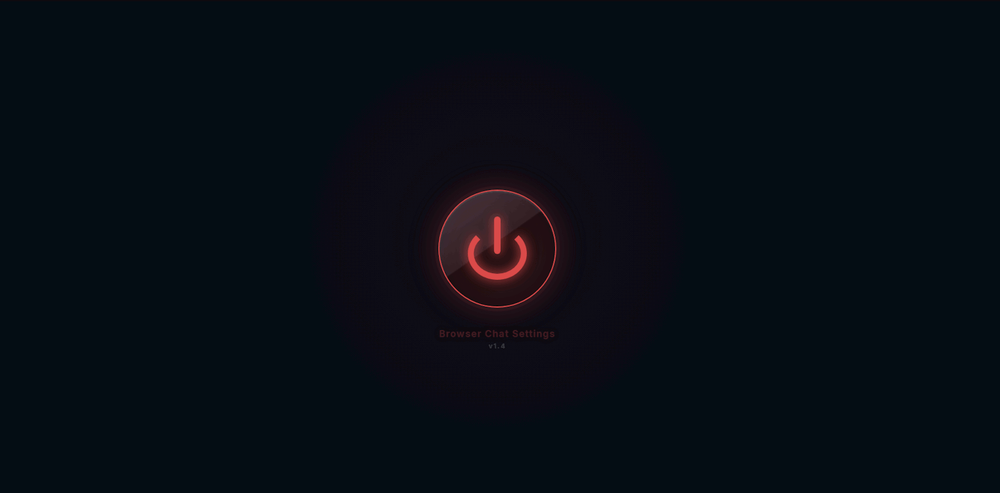
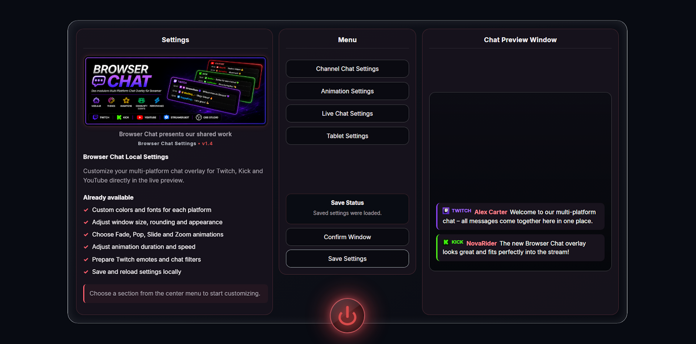
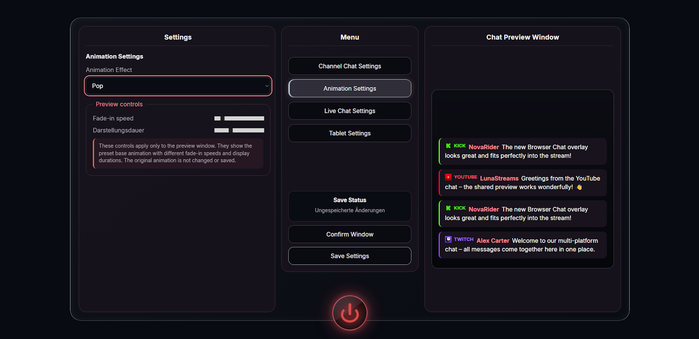
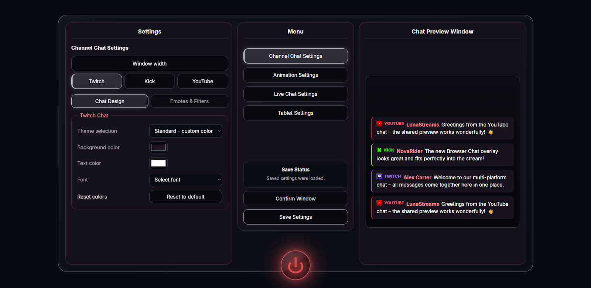
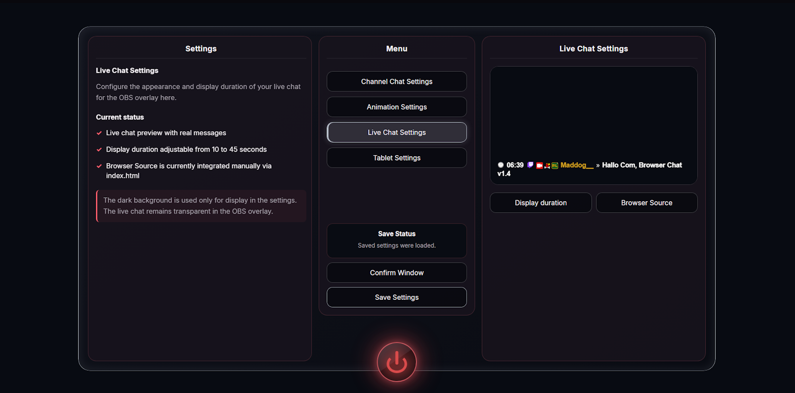
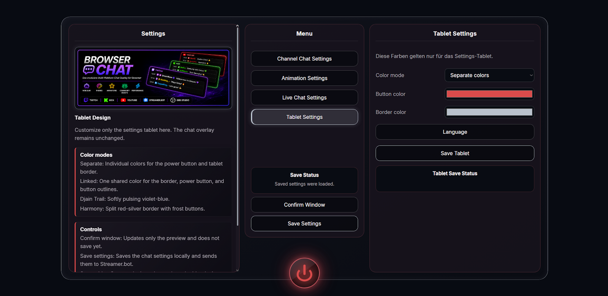
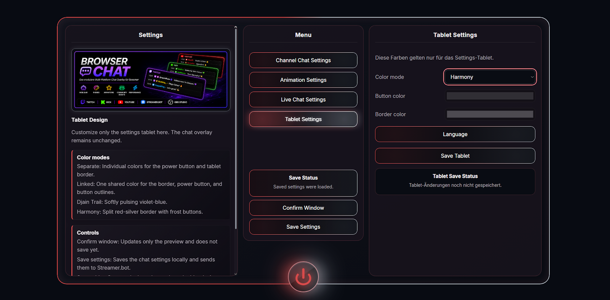

# Browser Chat Settings – Preview v1.4

This page provides a visual overview of the Browser Chat Settings tablet
and its main configuration areas in version 1.4.

Settings can be tested directly in the preview and saved locally afterward.

---

## 🔴 Start / Power

The Browser Chat Settings tablet is opened using the power button.
The animated start screen provides the entry point to the settings.

---

## ⚙️ Main View

The main view provides the central overview of the Settings Tablet.

The center menu gives access to four main areas:

- Channel Chat Settings
- Animation Settings
- Live Chat Settings
- Tablet Settings

The shared chat preview is displayed on the right and allows changes
to be viewed directly.

---

## ✨ Animation Settings

The **Animation Settings** define how new chat messages appear
in the preview.

Different animations are available, together with controls for
fade-in speed and display duration.

The Preview Controls affect only the preview and do not overwrite
the original animation settings.

---

## 💬 Channel Chat Settings

The **Channel Chat Settings** contain individual configuration options
for Twitch, Kick and YouTube.

Available options include:

- Window width
- Platform selection
- Chat design
- Background color
- Text color
- Font
- Emotes & Filters

The shared preview shows directly how messages from the different
platforms are displayed in Browser Chat.

---

## 📡 Live Chat Settings

The **Live Chat Settings** display the actual live chat used by the
OBS browser overlay.

The display duration of chat messages can be adjusted here.

The dark background is used only for displaying the chat inside
the Settings Tablet. The live chat remains transparent in the OBS overlay.

---

## 🎨 Tablet Settings

The **Tablet Settings** change only the appearance of the Settings Tablet
and do not affect the chat overlay.

Different color modes are available, together with individual settings
for the button and tablet border colors.

---

## 🩶 Harmony Theme

**Harmony** is one of the integrated designs for the Settings Tablet.

The theme combines a split red-silver border with bright frost-style
buttons and a matching power button.

---

## 🔴 Power / Close

The Settings Tablet can be closed again using the power button.

Previously saved settings remain available after closing the tablet.

---

**Browser Chat Settings · v1.4**